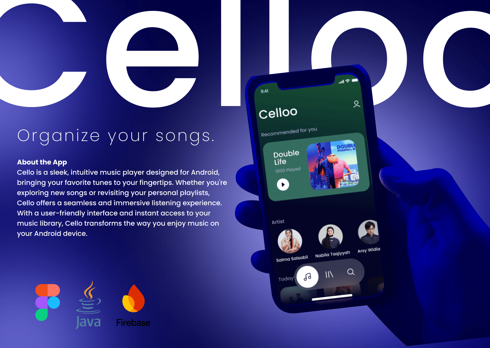

# Celloo 🎶

**Celloo** adalah aplikasi pemutar musik untuk Android yang dirancang untuk menghadirkan pengalaman mendengarkan musik yang sederhana dan bebas distraksi. Berbeda dengan banyak aplikasi musik modern yang mengutamakan fitur seperti rekomendasi berbasis algoritma canggih atau personalisasi, Celloo bertujuan mengembalikan esensi utama dari mendengarkan musik—menikmati musik itu sendiri. Dengan antarmuka yang ramah pengguna dan akses instan ke perpustakaan musik Anda, Celloo memungkinkan Anda fokus sepenuhnya pada pengalaman mendengarkan tanpa gangguan yang tidak perlu.

## Cobalah Demo Aplikasi Kami Sekarang ⏬
[Download_Celloo_Apk](https://github.com/muhfajarags/project-papb-2024/releases/download/v0.0.1/celloo.apk)

## Fitur Utama (Vision) 🚀

- **Antarmuka Pengguna yang Ramah** - Desain yang sederhana dan intuitif untuk pengalaman pemutaran yang menyenangkan.
- **Akses Perpustakaan Musik Instan** - Putar lagu langsung dari koleksi musik di perangkat Anda.
- **Pemutar Musik Berkualitas** - Suara jernih dan pemutaran yang lancar tanpa gangguan.

## Fitur Yang Tersedia Saat Ini 🚀

- **Antarmuka Pengguna yang Ramah** - Desain yang sederhana dan intuitif untuk pengalaman pemutaran yang menyenangkan.
- **Today Hits** - Dapatkan informasi terkini terkait lagu yang sedang trend.
- **Search** - Temukan musik yang kamu sukai.
- **Edit Profile** - Sesuaikan profile Celloo dengan diri kamu.

## Branch Structure 🗂️

Untuk kolaborasi yang efektif, kami menggunakan beberapa branch untuk setiap developer, yaitu:

- **main** - Dikelola dan diintegrasikan oleh Muhammad Fajar Agus Saputra
- **gilang** - Dikelola oleh Gilang Athaya Nauval Pratama
- **reno-main** - Dikelola oleh Reno Bonasa Hata Pasaribu

Note: Kami menggunakan 1 firebase yang sama dalam  implementasi realtime database. 

## Developer 👥

- **Muhammad Fajar Agus Saputra** – 225150400111030
- **Gilang Athaya Nauval Pratama** – 225150400111040
- **Reno Bonasa Hata Pasaribu** – 225150407111099

## Kontribusi 🤝

Kami menyambut kontribusi dalam bentuk ide, laporan bug, atau fitur baru untuk meningkatkan Celloo. Silakan fork repo ini dan kirimkan pull request Anda ke branch terkait.

Selamat menikmati pengalaman musik Anda dengan **Celloo**! 🎶
